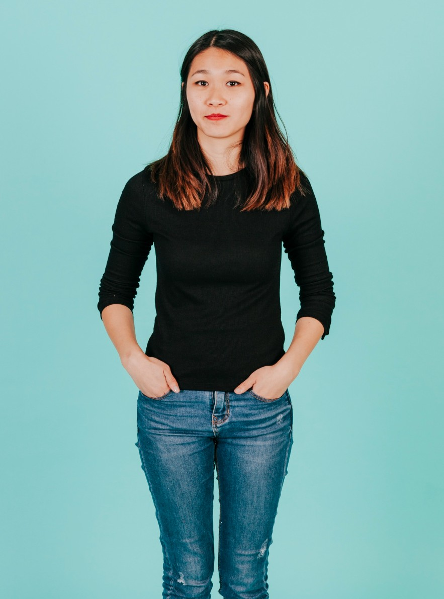
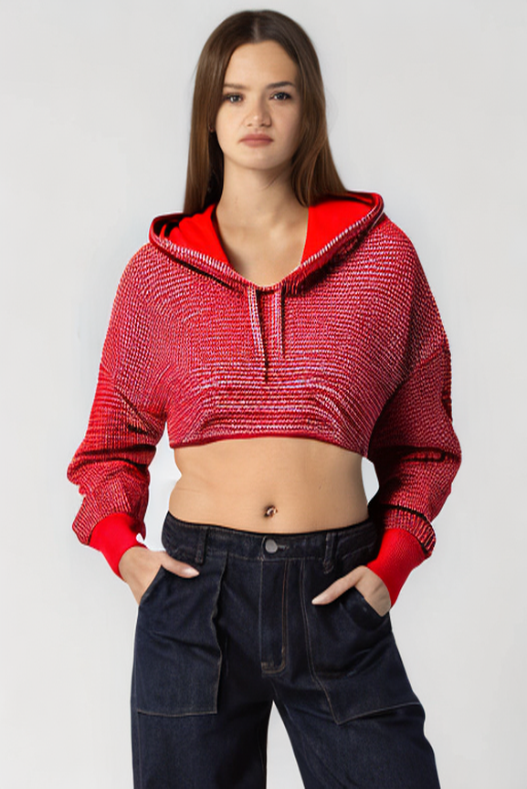

# Mini Virtual Try-On System

A simple AI pipeline that takes a photo of a person and a clothing description, then generates a new image of that person wearing the described clothing — keeping their face, pose, and background intact.

---

## Demo

| Before | After |
|---|---|
|  |  |

---

## How It Works

```
Input (person photo + clothing prompt)
        ↓
Phase 2 — Clothing Segmentation
  → SegFormer detects clothing region
  → Generates binary mask (white = replace, black = keep)
        ↓
Phase 3 — Stable Diffusion Inpainting
  → Mask + image + prompt sent to Replicate API
  → Model fills masked region with new clothing
  → Face, pose, background preserved
        ↓
Output (before vs after comparison)
```

---

## Project Structure

```
virtual-tryon/
├── segmentation.py      # Phase 2 — clothing mask generation
├── pipeline.py          # Phase 3 — inpainting via Replicate API
├── app.py               # Phase 4 — Gradio web UI
├── requirements.txt     # All dependencies
├── .env.example         # API key template
├── .gitignore
├── README.md
└── samples/
    ├── input.jpg        # Example input photo
    ├── output.png       # Generated result
    └── comparison_*.png # Before vs after side by side
```

---

## Setup

### 1. Clone the repo

```bash
git clone https://github.com/yourusername/virtual-tryon.git
cd virtual-tryon
```

### 2. Install dependencies

```bash
pip install -r requirements.txt
```

### 3. Add API keys

Create a `.env` file in the project root:

```
REPLICATE_API_TOKEN=r8_xxxxxxxxxxxxxxxxxxxx
HF_TOKEN=hf_xxxxxxxxxxxxxxxxxxxx
```

Get your tokens:
- **Replicate** → [replicate.com](https://replicate.com) → Profile → API tokens (~$3 credit needed)
- **Hugging Face** → [huggingface.co](https://huggingface.co) → Settings → Access Tokens (free)

---

## Usage

### Terminal

```bash
python pipeline.py samples/input.jpg "blue oversized hoodie"
python pipeline.py samples/input.jpg "red leather jacket"
python pipeline.py samples/input.jpg "white linen shirt"
```

Output files saved to `samples/`:
- `output.png` — generated result
- `comparison_*.png` — before vs after side by side
- `mask_overlay.png` — clothing mask used

### Web UI (Gradio)

```bash
python app.py
```

Open `http://localhost:7860` in your browser. Upload a photo, type a clothing description, click Generate.

### Test segmentation only (Phase 2)

```bash
python segmentation.py samples/input.jpg
```

Saves `output_overlay.png` showing the detected clothing region in red.

---

## Tech Stack

| Component | Tool |
|---|---|
| Clothing segmentation | SegFormer (`mattmdjaga/segformer_b2_clothes`) |
| Image inpainting | Stable Diffusion Inpainting via Replicate API |
| Image processing | Pillow, NumPy |
| Web UI | Gradio |
| Language | Python 3.11 |

---


## .env.example

```
REPLICATE_API_TOKEN=your_replicate_token_here
HF_TOKEN=your_huggingface_token_here
```

---

## License

For educational and non-commercial use only.
The IDM-VTON model used is under CC BY-NC-SA 4.0 license.
