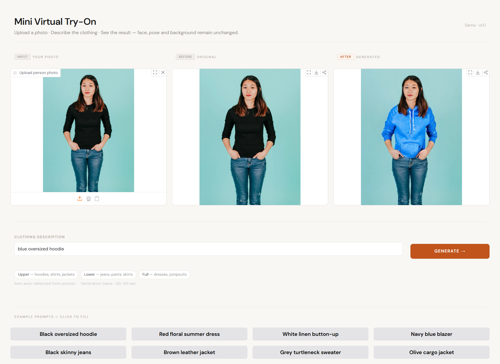
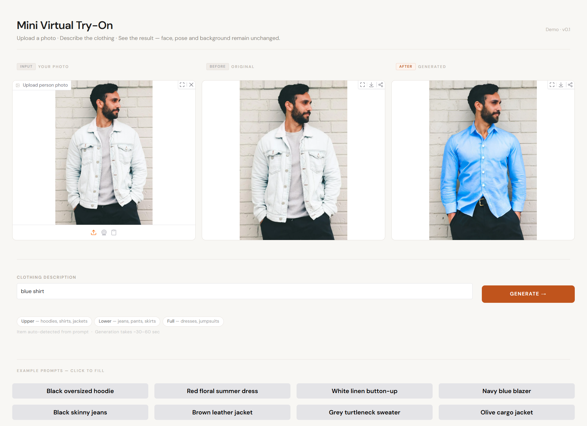
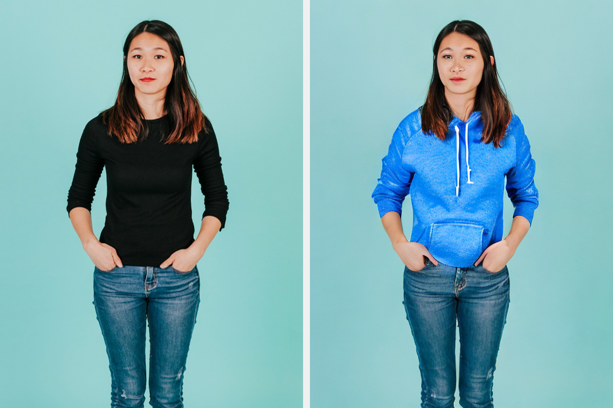
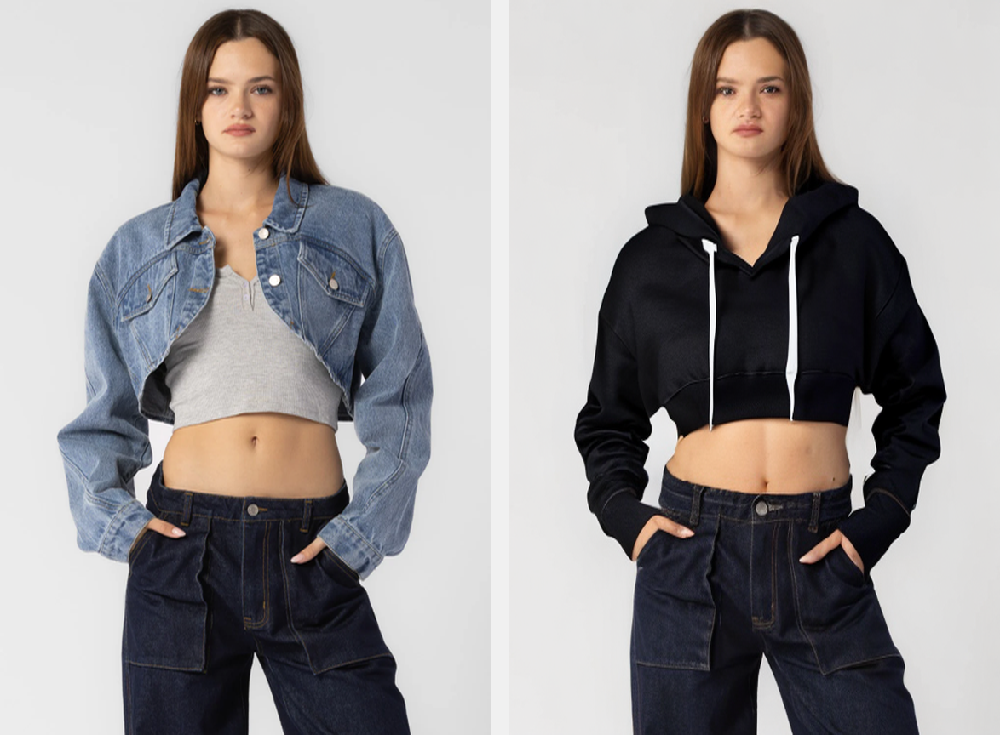
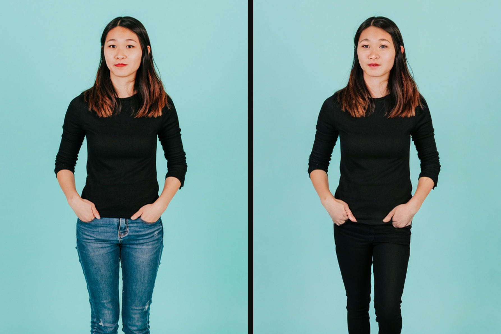
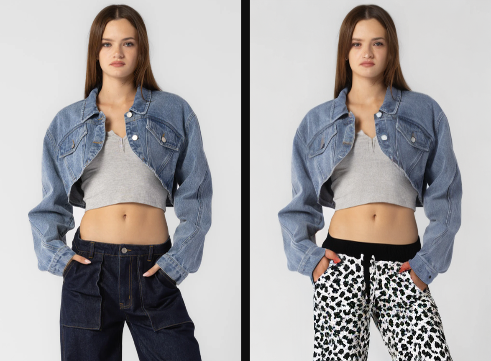

# 👗 Mini Virtual Try-On System

An AI pipeline that takes a photo of a person and a clothing description, then generates a new image of that person wearing the described clothing — keeping their face, pose, and background completely unchanged.

---

## 🖼️ User interface

example 1

<p align="center">  </p>

example 2

<p align="center">  </p>


## 🖼️ Input and output comparison

blue_oversized_hoodie

<p align="center">  </p>

black_oversized_hoodie

<p align="center">  </p>

black_skinny_jeans

<p align="center">  </p>

pants

<p align="center">  </p>

---

## What It Does

Upload a photo and type something like `"blue oversized hoodie"` or `"black skinny jeans"`. The system:

1. Detects which clothing item you described
2. Locates that specific region in the photo
3. Replaces only that region using AI — everything else stays the same

---

## Models & APIs Used

### 🔷 SegFormer — Clothing Segmentation
**Model:** [`mattmdjaga/segformer_b2_clothes`](https://huggingface.co/mattmdjaga/segformer_b2_clothes)
**Source:** Hugging Face
**What it does:** Segments a person photo into labeled regions — `Upper-clothes`, `Pants`, `Face`, `Background`, `Left-leg`, etc. Used to generate the binary mask that tells the inpainting model exactly which pixels to replace.
**Why this model:** Fine-tuned specifically on fashion/clothing datasets, giving much better clothing boundary accuracy than a general segmentation model.

---

### 🔷 rembg — Background Removal
**Library:** [`rembg`](https://github.com/danielgatis/rembg)
**Underlying model:** U2-Net
**What it does:** Removes the background from the person photo before segmentation runs. The person is pasted onto a plain white background so the segmentation model doesn't confuse background colors with clothing colors.
**Why needed:** Without this step, photos with backgrounds similar in color to the clothing (e.g. pink wall + orange shirt) cause the segmentation mask to bleed everywhere.

---

### 🔷 Stable Diffusion Inpainting — Image Generation
**Model:** [`stability-ai/stable-diffusion-inpainting`](https://replicate.com/stability-ai/stable-diffusion-inpainting)
**Source:** Replicate API
**Version:** `95b7223104132402a9ae91cc677285bc5eb997834bd2349fa486f53910fd68b3`
**What it does:** Takes the original photo, the binary clothing mask, and a text prompt — then fills only the masked region with new AI-generated content matching the prompt. All pixels outside the mask remain pixel-perfect identical to the original.
**Key parameters used:**

| Parameter | Value | Purpose |
|---|---|---|
| `strength` | 0.55–0.75 | How much to deviate from original image |
| `guidance_scale` | 12.0 | How strictly to follow the text prompt color/style |
| `num_inference_steps` | 50 | Generation quality — more steps = sharper result |

---

### 🔷 Replicate API
**URL:** [replicate.com](https://replicate.com)
**What it does:** Hosts and runs the Stable Diffusion inpainting model on cloud GPU hardware. Accepts base64-encoded images and prompt via REST API, runs the model asynchronously, and returns a URL to the generated image.
**Cost:** ~$0.01 per run for SD inpainting
**Why used:** No local GPU required — the heavy computation runs in the cloud.

---

### 🔷 Hugging Face Inference
**URL:** [huggingface.co](https://huggingface.co)
**What it does:** Hosts the SegFormer model weights. The `transformers` library downloads and runs the model locally on first use.
**Used for:** Loading `SegformerImageProcessor` and `AutoModelForSemanticSegmentation`

---

### 🔷 Gradio — Web UI
**Library:** [`gradio`](https://gradio.app)
**What it does:** Provides the browser-based UI — photo upload, text input, before/after display, and example prompt buttons. Runs a local web server at `http://localhost:7860`.

---

## The Science Behind the Project

### Step 1 — Clothing Segmentation (SegFormer)

Before anything can be changed, the AI needs to know *where* the clothing is in the photo.

A model called **SegFormer** (fine-tuned on fashion datasets) looks at every pixel in the image and assigns a label to each one — `Upper-clothes`, `Pants`, `Face`, `Background`, etc. All pixels belonging to the target clothing item are merged into a **binary mask** — a black and white image where:

- **White pixels** = the clothing area (will be replaced)
- **Black pixels** = everything else (face, background, jeans — untouched)

The mask is then dilated slightly outward and edge-smoothed so the replacement blends naturally at the seams.

```
Input photo → SegFormer → Per-pixel labels → Binary mask
```

### Step 2 — Background Removal (rembg)

Before segmentation runs, **rembg** strips the background completely and isolates just the person on a white background. This prevents the model from confusing a similarly-colored background with the clothing — a major source of mask errors.

### Step 3 — Inpainting (Stable Diffusion)

With the mask ready, three things are sent to a **Stable Diffusion inpainting model**:

1. The original photo
2. The binary mask
3. A text prompt describing the new clothing

The model looks at the unmasked area (face, background, jeans) for context, then generates new pixels *only inside the white mask region* — guided by the text prompt.

### Step 4 — Smart Item Detection

The system reads your prompt and detects the exact clothing item mentioned, then selects only the relevant mask labels:

```
"blue hoodie"        → masks upper-clothes only
"black skinny jeans" → masks pants + left-leg + right-leg only
"floral dress"       → masks dress region only
"navy blazer"        → masks upper-clothes only
```

This means if you ask for jeans, only the legs get changed — the jacket and shirt stay exactly the same.

---

## Project Structure

```
virtual-tryon/
├── segmentation.py      # Phase 2 — clothing mask generation
├── pipeline.py          # Phase 3 — inpainting via Replicate API
├── app.py               # Phase 4 — Gradio web UI
├── requirements.txt
├── .env.example
├── .gitignore
├── README.md
└── samples/
    ├── input.jpg
    ├── output.png
    └── comparison_*.png
```

---

## Tech Stack

| Component | Technology |
|---|---|
| Clothing segmentation | [SegFormer](https://huggingface.co/mattmdjaga/segformer_b2_clothes) |
| Background removal | [rembg](https://github.com/danielgatis/rembg) |
| Image inpainting | [Stable Diffusion Inpainting](https://replicate.com/stability-ai/stable-diffusion-inpainting) |
| API hosting | [Replicate](https://replicate.com) |
| Web UI | [Gradio](https://gradio.app) |
| Image processing | [Pillow](https://pillow.readthedocs.io), [NumPy](https://numpy.org) |
| Language | Python 3.11 |

---

## Setup

### 1. Clone the repo

```bash
git clone https://github.com/yourusername/virtual-tryon.git
cd virtual-tryon
```

### 2. Install dependencies

```bash
pip install -r requirements.txt
```

### 3. Add API keys

Create a `.env` file in the project root:

```
REPLICATE_API_TOKEN=r8_xxxxxxxxxxxxxxxxxxxx
HF_TOKEN=hf_xxxxxxxxxxxxxxxxxxxx
```

Get your tokens:
- **Replicate** → [replicate.com](https://replicate.com) → Profile → API Tokens (~$3 credit needed)
- **Hugging Face** → [huggingface.co](https://huggingface.co) → Settings → Access Tokens (free)

---

## Usage

### Web UI (Gradio)

```bash
python app.py
```

Open `http://localhost:7860` in your browser. Upload a photo, type a clothing description, click Generate.

### Terminal

```bash
# Upper body
python pipeline.py samples/input.jpg "blue oversized hoodie"
python pipeline.py samples/input.jpg "white linen shirt"
python pipeline.py samples/input.jpg "brown leather jacket"

# Lower body
python pipeline.py samples/input.jpg "black skinny jeans"
python pipeline.py samples/input.jpg "red skirt"

# Full body
python pipeline.py samples/input.jpg "floral summer dress"
python pipeline.py samples/input.jpg "white jumpsuit"
```

Output saved to `samples/`:
- `output.png` — generated result
- `comparison_*.png` — before vs after side by side
- `mask_overlay.png` — the clothing mask that was used

### Test segmentation only

```bash
python segmentation.py samples/input.jpg
```

Saves `output_overlay.png` showing the detected clothing region in red.

---

## Supported Clothing Types

| Category | Examples |
|---|---|
| **Upper body** | hoodie, shirt, jacket, blazer, coat, sweater, turtleneck, cardigan |
| **Lower body** | jeans, pants, skirt, shorts, leggings, trousers |
| **Full body** | dress, jumpsuit, romper, overalls, gown |
| **Accessories** | scarf, hat, cap, beanie |

The system automatically detects which category your prompt belongs to and masks only that region.

---

## Tips for Best Results

**Photo requirements:**
- Plain solid background (white, grey, or any single color)
- Clothing color should contrast clearly with the background
- Person facing forward, arms relaxed at sides
- Person should fill most of the frame

**Prompt tips:**
- Keep prompts short and specific: `"red hoodie"` not `"change clothes to red hoodie"`
- Include the color: `"navy blue blazer"` works better than just `"blazer"`
- Be specific about style: `"oversized"`, `"fitted"`, `"cropped"` all help

---

## How It Compares to ChatGPT Image Generation

| Feature | This Pipeline | ChatGPT (DALL-E) |
|---|---|---|
| Uses your actual photo | Yes | No |
| Preserves your face | Yes | No |
| Changes only target clothing | Yes | No |
| Can be integrated into apps | Yes | Limited |
| Works via API | Yes | Yes |
| Output quality | Medium | High |

ChatGPT generates a brand new image from scratch — it doesn't do try-on. This pipeline works with your actual photo and only modifies the clothing region, which is a fundamentally harder problem and more useful for real-world applications like e-commerce.

---

## License

For educational and non-commercial use only.
The IDM-VTON model is under CC BY-NC-SA 4.0 license.
